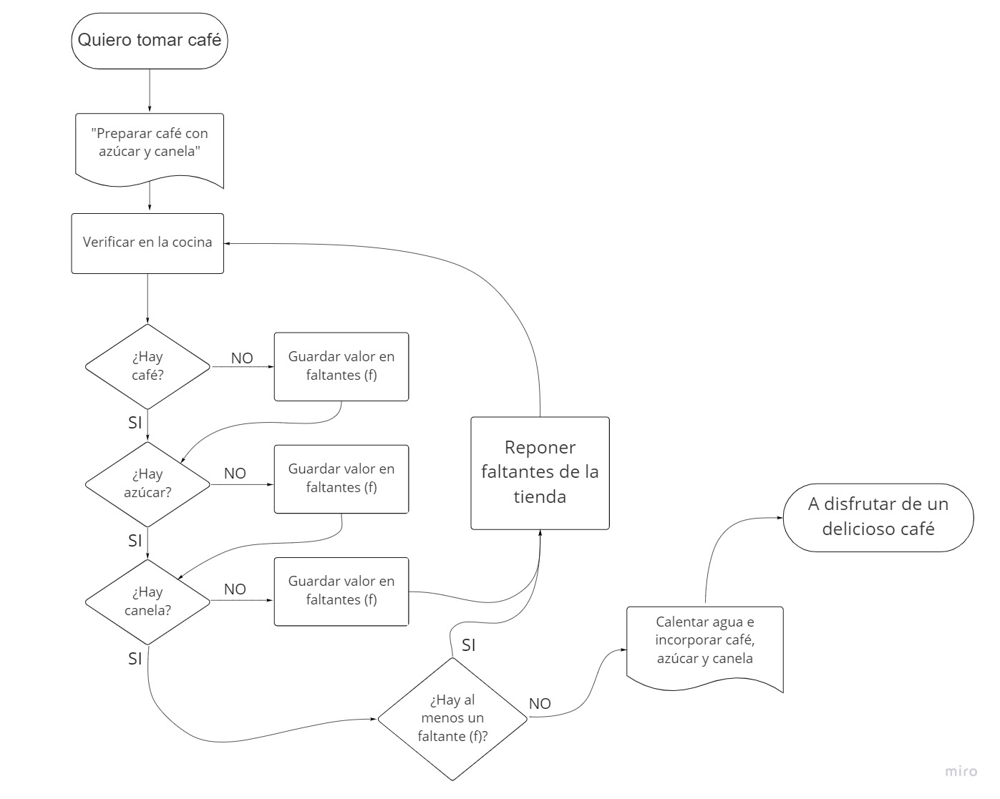

##HOMEWORK

crear un diagrama de flujo para resolver un problema (puede ser cualquiera ej: revisar una quiz)
ejemplo diagrama: https://miro.com/app/board/uXjVOhHDEEo=/?share_link_id=214505124272
- subir la imagen a github y en el Readme.md explicar el flujo del diagrama.

##PLANTEAMIENTO

Quiero tomar café con azucar y canela. Debo verificar primero en mi cocina si tengo todos los ingredientes necesarios, y en el caso de que me falte al menos uno debo ir a la tienda a reponer los faltantes para poder preparar mi café con azúcar y canela.

##DIAGRAMA DE FLUJO

##ESCRITORIO

1. Inicio
2. Instrucción de preparar café con azúcar y canela
3. Verificación de ingredientes:
- Si hay café continuar / si no hay café guardar el valor negativo en faltantes (f) y seguir preguntando
- Si hay azúcar continuar / si no hay azúcar guardar el valor negativo en faltantes (f) y seguir preguntando
- Si hay canela continuar / si no hay canela guardar el valor negativo en faltantes (f)
4. En la salida preguntar si al menos una de la respuesta es negativa
- Si la respuesta es SI, ir a la tienda y volver a verificar los ingredientes
- Si la respuesta es NO, continuar
5. Calentar agua y mezclar los ingredientes
6. Cierre.